# franz-go Internals

This document is your guide to working on the `kgo` package. It covers how the
client is structured, what the main code paths do, and what you need to
understand before changing things.

You should be comfortable with Go concurrency (goroutines, channels, mutexes,
atomics). If you have never used Kafka, the Background section will orient you.

## How to Use This Document

**If you are about to make your first change**, read the [Architecture
Overview](#architecture-overview) and the section for whichever path you are
modifying (produce, consume, metadata, etc.). Then read [Concurrency
Patterns](#concurrency-patterns) - the client uses custom primitives that you
will encounter everywhere.

**If you are debugging a race or deadlock**, go straight to the concurrency
rules: [cursor useState](#cursor-usestate-sourcego) for consume races, [lock
ordering](#lock-ordering) for group consumer deadlocks, [batch failure
rules](#when-can-a-batch-fail) for produce ordering issues.

**If you are looking for a specific file**, see the [File Map](#file-map).

## Table of Contents

- [Background: What This Client Does](#background-what-this-client-does)
- [Architecture Overview](#architecture-overview)
- [The Produce Path](#the-produce-path)
- [The Consume Path](#the-consume-path)
- [Consumer Sessions](#consumer-sessions)
- [Group Consumers](#group-consumers)
- [Transactions](#transactions)
- [Metadata](#metadata)
- [Broker Connections](#broker-connections)
- [Concurrency Patterns](#concurrency-patterns)
- [File Map](#file-map)

---

## Background: What This Client Does

Kafka is a distributed log. Data is organized into **topics**, each split into
**partitions**. Each partition lives on a specific **broker** (the "leader").
Producing a record means sending it to the correct broker for that partition.
Consuming means fetching records from the correct broker for each partition.

The mapping from partitions to brokers changes over time - brokers go down,
partitions are reassigned, new topics are created. The client discovers this
mapping through **metadata requests** and reacts to changes by moving its
internal state between brokers.

The client's job, in essence, is:

1. **Produce**: accept records from user code, batch them efficiently, send
   them to the right broker, report success or failure back to the user
2. **Consume**: fetch records from the right brokers, buffer them, deliver
   them to user code when polled
3. **Coordinate**: if consuming as part of a consumer group, participate in
   the group protocol to decide which partitions this client is responsible
   for
4. **Stay current**: periodically refresh metadata so the client knows where
   each partition lives

All four of these happen concurrently. The rest of this document explains how.

---

## Architecture Overview

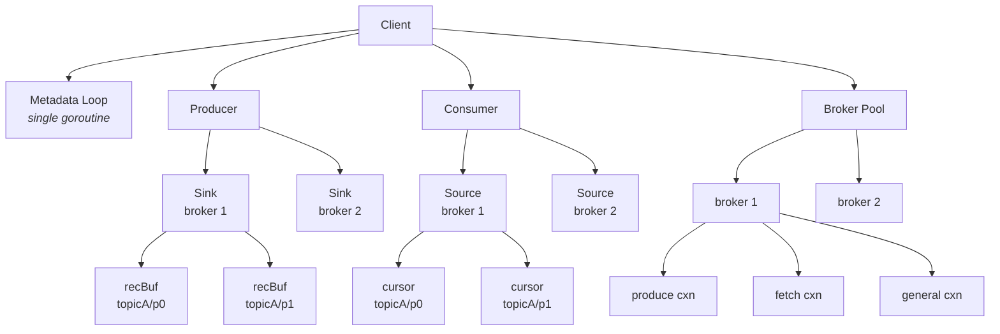

The core abstractions:

- **Client** (`client.go`): the top-level owner of everything. Created by
  `NewClient`. Holds the broker pool, the metadata loop, and the optional
  producer/consumer.

- **Sink** (`sink.go`): one per broker, handles the produce side. A sink
  collects records destined for its broker and sends them in batched produce
  requests. Think of it as "the outbox for broker N."

- **Source** (`source.go`): one per broker, handles the consume side. A source
  issues fetch requests to its broker and buffers the results for polling.
  Think of it as "the inbox from broker N."

- **recBuf** (`sink.go`): one per topic-partition, owned by a sink. This is
  where records are buffered before being sent. When a partition's leader
  changes, the recBuf is moved from one sink to another.

- **cursor** (`source.go`): one per topic-partition, owned by a source. Tracks
  where we are consuming from in that partition (offset, epoch). When a
  partition's leader changes, the cursor is moved from one source to another.

- **broker** (`broker.go`): represents a Kafka broker and manages its TCP
  connections. Each broker maintains up to five connections, separated by
  usage (produce, fetch, group, slow, general) to prevent different workloads
  from blocking each other.

When metadata changes (e.g., partition 3 moves from broker 1 to broker 2),
the client moves the relevant recBuf or cursor from the old sink/source to
the new one. This is called **migration** and happens under locks.

---

## The Produce Path

### What happens when you call `Produce()`

Here is the full journey of a record from user code to the Kafka broker and
back:

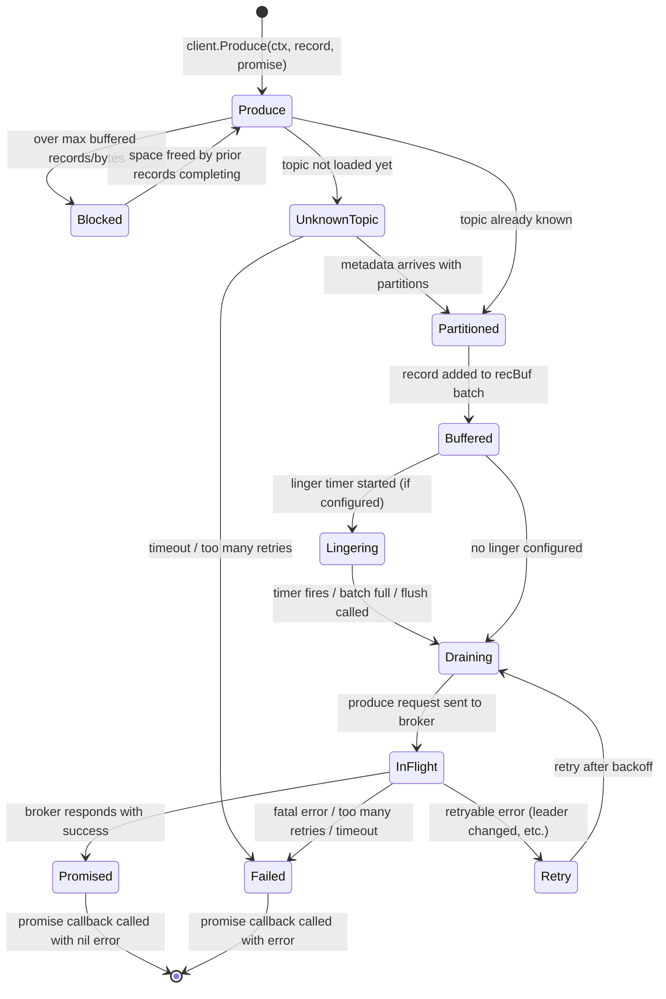

**Step 1: Validation and backpressure** (`producer.go:Produce`)

The client checks that the record has a topic and that we are in a valid
state (e.g., if transactional, we must be in a transaction). If the number of
buffered records or bytes exceeds the configured maximum, the call blocks until
space is available. This is the client's backpressure mechanism.

**Step 2: Find the right partition** (`producer.go:loadPartsAndPartition`)

The client looks up the topic's partition metadata. If the topic hasn't been
loaded yet (first produce to this topic), the record is buffered in an
"unknown topics" holding area and a metadata refresh is triggered. Once
metadata arrives, all held records are flushed to their partitions.

If the topic is known, the configured partitioner (e.g., round-robin, hash by
key) selects a partition. The record is then handed to that partition's
`recBuf`.

**Step 3: Buffer into a batch** (`sink.go:bufferRecord`)

The recBuf tries to append the record to the current (last) batch. A batch is
a group of records for a single partition that will be serialized together. A
produce request can contain batches from multiple partitions. If the current
batch is full (exceeds `maxRecordBatchBytes`), a new batch is started.

After buffering, the recBuf decides: should we drain now, or linger?

**Step 4: Linger or drain** (`sink.go:checkIfShouldDrainOrStartLinger`)

If lingering is configured (common for throughput optimization), and there is
exactly one non-full batch, the recBuf starts a linger timer. The timer delays
draining to allow more records to accumulate into the same batch, improving
compression and reducing request overhead.

If lingering is not configured, or there are multiple batches (meaning one is
full), or a flush is in progress, draining starts immediately.

**Step 5: Build and send the produce request** (`sink.go:drain`, `createReq`)

The sink's drain loop:
1. Backs off if the previous request failed
2. Acquires an inflight semaphore slot (limiting concurrent produce requests)
3. Ensures the client has a valid producer ID (for idempotency)
4. Builds a produce request by iterating all recBufs owned by this sink and
   collecting their ready batches
5. Sends the request to the broker

The produce request is built with awareness of wire-level size limits - it
stops adding batches when approaching `maxBrokerWriteBytes`.

**Step 6: Handle the response** (`sink.go:handleReqResp`)

Responses are processed **in order** (see [Sequenced Response
Handling](#sequenced-response-handling) below). For each partition in the
response:

- **Success**: the batch's records are "promised" (callbacks called with nil
  error, offsets filled in)
- **Retryable error** (leader changed, not enough replicas, etc.): the batch
  is returned to the recBuf for retry
- **Fatal error** (message too large, auth failure, etc.): the batch's records
  are promised with the error

### Sequenced response handling

Kafka's idempotent producer assigns sequence numbers to each batch. The sink
must process responses in the same order it sent requests so that it handles
the earliest outstanding batch first. Processing out of order could cause
incorrect retries or sequence number mismatches (OOOSN - Out Of Order
Sequence Number).

Produce responses are processed strictly in order using a ring buffer
(`seqResp` ring on each sink):

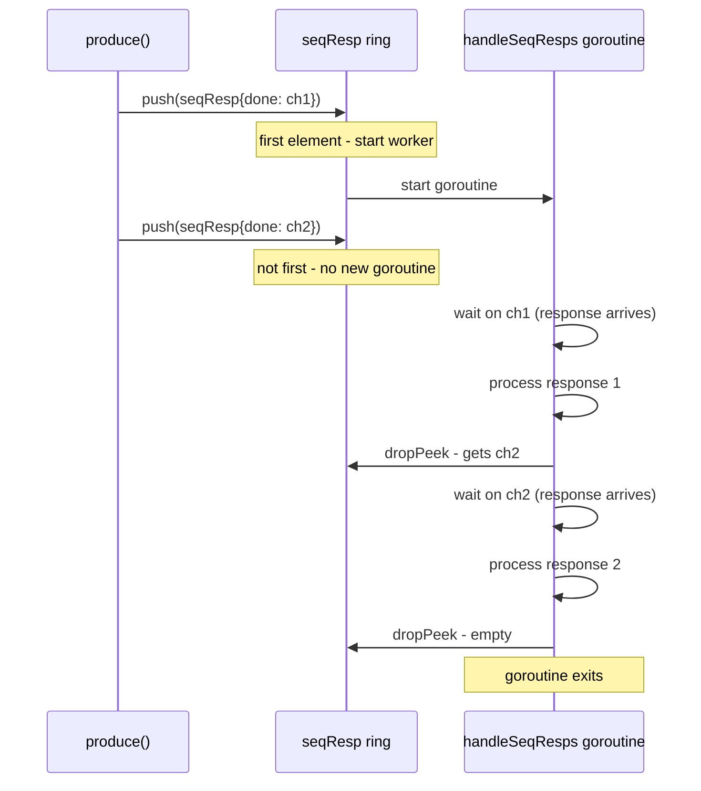

The key insight: a goroutine is started only when the first element is pushed,
and it exits when the ring is empty. This avoids running a permanent goroutine
per sink. This "ring pattern" is used in several places throughout the client
(see [Concurrency Patterns](#concurrency-patterns)).

### Linger timer details

The linger timer lives on the `recBuf` (per topic-partition), not on the sink
(per broker). This is because different partitions may fill at different rates,
and we want each partition to independently decide when it has waited long
enough.

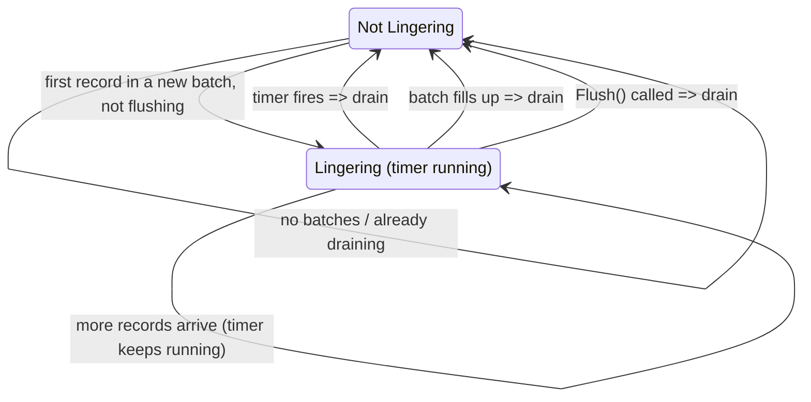

Implementation detail: the timer and callback function are reused across linger
cycles to minimize allocations. The `isLingering` bool tracks whether the timer
is active (rather than checking `lingering == nil`) because the timer object
persists even when stopped.

### When can a batch fail?

This is subtle and important for idempotency. The rules:

1. **Non-idempotent client**: any batch can fail at any time
2. **Idempotent client**: a batch can only fail if BOTH:
   - `canFailFromLoadErrs` is true (we are not waiting for a produce response)
   - `unsureIfProduced` is false (we haven't received an ambiguous response)

Why `unsureIfProduced`? If the broker responds with `REQUEST_TIMED_OUT` or
`NOT_ENOUGH_REPLICAS_AFTER_APPEND`, the record may or may not have been
persisted. We cannot cancel it - we must keep retrying until we get a
definitive success or failure.

Why `canFailFromLoadErrs`? While a produce request is in flight, we do not know
whether the broker will persist the batch. We set this to false when sending
and back to true when the response arrives. This prevents metadata-driven error
bumps from canceling a batch that is currently being written.

---

## The Consume Path

### What happens when you call `PollFetches()`

Fetching is designed around a "double buffering" model: while the user is
processing one set of fetched records, the source is already fetching the next
set in the background. This keeps the pipeline full.

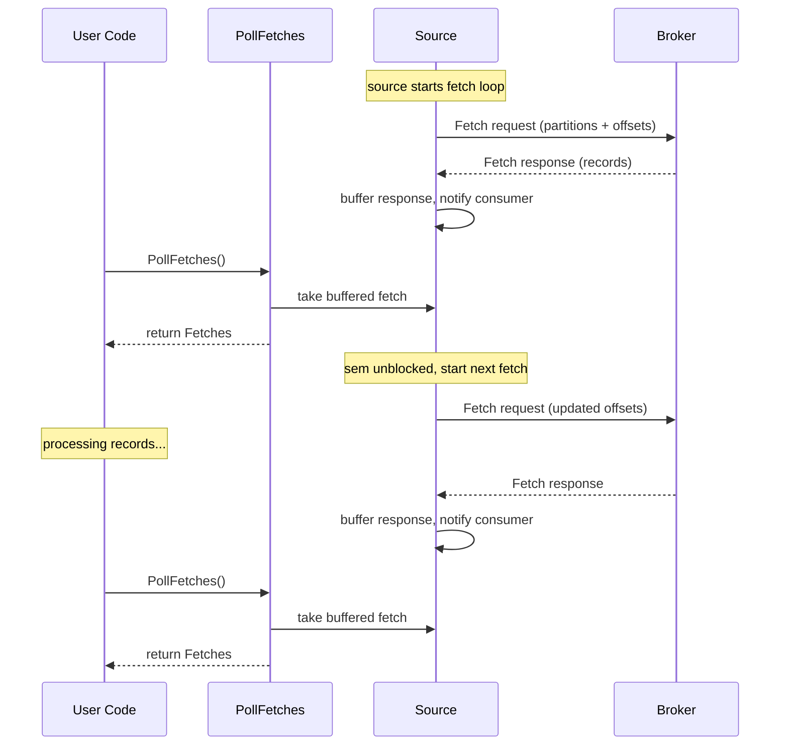

### Cursors: tracking where we are

Each topic-partition the client is consuming from has a **cursor**. The cursor
tracks:

- **offset**: the next offset to fetch
- **lastConsumedEpoch**: used for truncation detection (KIP-320)
- **hwm**: the partition's high watermark (how far behind we are)

Cursors have a state machine controlled by an atomic bool (`useState`):

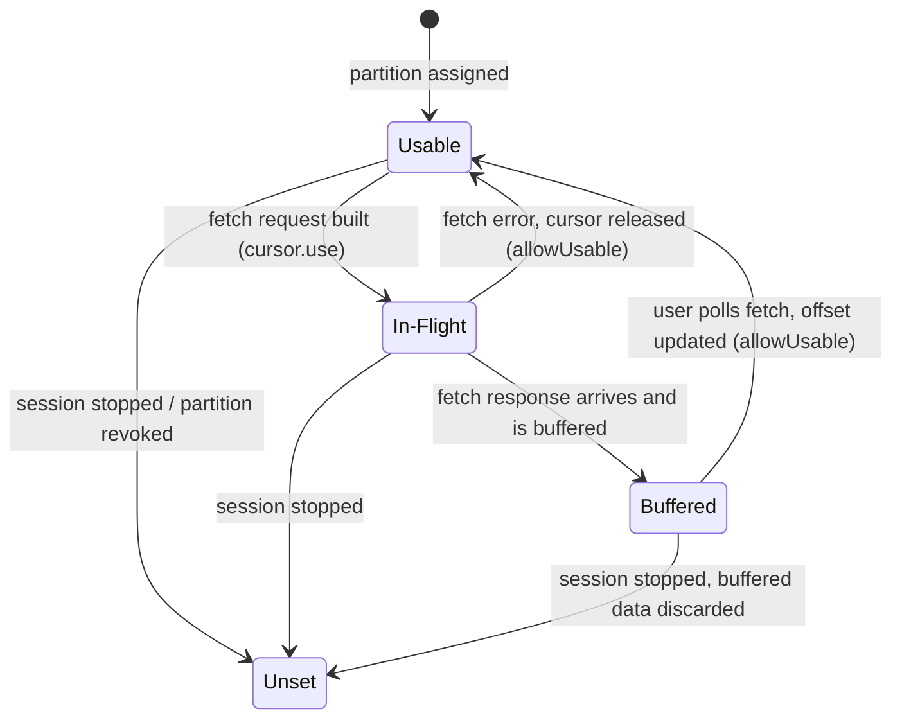

**Why an atomic bool?** The state change must be a single operation that
atomically publishes availability - a mutex would require holding the lock
across the fetch lifecycle, which is impractical. The atomic gives us a
lock-free transition that is checked by the fetch loop, set by the poll path,
and cleared by session management.

**Critical safety rule:** after `allowUsable()` calls `useState.Swap(true)`,
the cursor is IMMEDIATELY eligible for use by a concurrent fetch goroutine.
This means:

- You MUST read any cursor fields you need BEFORE the Swap
- You MUST NOT write any cursor fields AFTER the Swap
- The pattern is always: remove from source, modify fields, Swap(true), add
  to source

Violating this rule causes data races. See the comment on `cursor.move()` in
source.go for the full explanation.

### Fetch sessions (KIP-227)

Without fetch sessions, every fetch request must include ALL partitions and
their current offsets. With many partitions, this is a lot of redundant data.

Fetch sessions (KIP-227) fix this: the broker remembers what the client asked
for last time. On subsequent requests, the client only sends partitions whose
offsets have changed. The broker only returns partitions that have new data.

The session state lives on each source (`fetchSession` struct):
- `session.used` maps topic/partition to the last-sent offset and epoch
- Each fetch response updates this map
- When a partition is removed from a source, it is added to "forgotten topics"
  in the next request to tell the broker to stop tracking it

If the broker evicts our session (it has a limited number of session slots),
it responds with `FETCH_SESSION_ID_NOT_FOUND`, and we start over with a full
fetch.

### Preferred replicas (KIP-392)

Normally, fetches go to the partition leader. But Kafka supports fetching from
follower replicas that are closer to the consumer (e.g., same rack/datacenter).
The broker indicates this by returning a "preferred replica" in the fetch
response.

When this happens:
1. The cursor is moved from the leader's source to the preferred replica's
   source
2. The cursor tracks when it was moved (`moveAt`)
3. Periodically (every `RecheckPreferredReplicaInterval`), the cursor moves
   back to the leader to re-check if the preferred replica is still optimal

---

## Consumer Sessions

A **consumer session** is the coordination layer between all sources, the poll
loop, and partition assignment changes. It exists because we need a way to
atomically stop all fetching, discard buffered data, and start fresh when
partitions are reassigned.

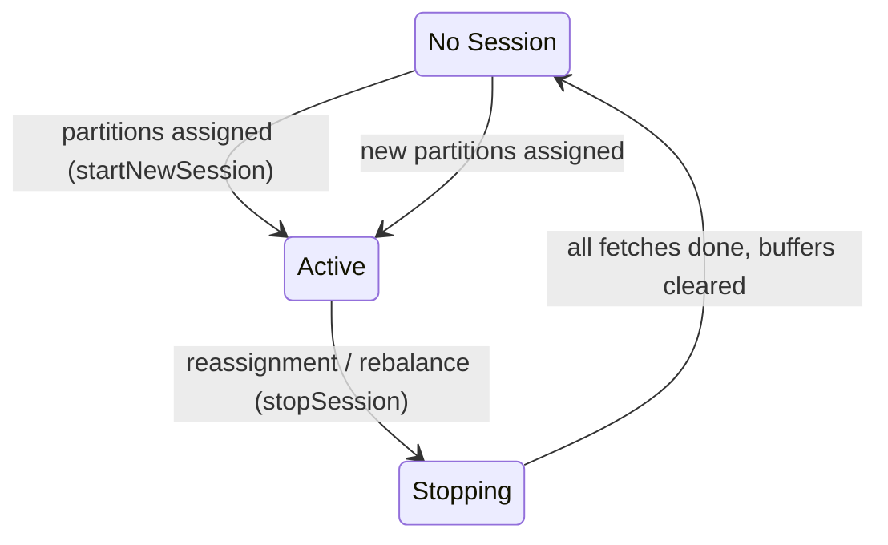

### Why sessions exist

Consider a consumer group rebalance: the group decides this client should stop
consuming partitions 0-4 and start consuming 5-9. Without sessions, we would
need to stop each fetch, discard each buffer, and start each new fetch one at
a time. With sessions, we:

1. Cancel the session context (all in-progress fetches abort)
2. Wait for all workers (fetches, offset lookups) to finish
3. Discard all buffered data
4. Start a new session with the new partition set
5. All sources restart fetching for whatever cursors they now own

### Stopping a session in detail

`stopSession` does this in a specific order (each step depends on the previous):

1. **Cancel the session context** - all in-progress fetches see `ctx.Done()`
   and return quickly
2. **Store `noConsumerSession`** - prevents any new source from starting a
   fetch loop
3. **Wait for all workers to finish** - blocks until every fetch, list-offsets,
   and epoch-load goroutine has exited
4. **Reset all fetch sessions** - clears broker-side session state so we start
   fresh
5. **Discard all buffered fetches** - releases cursor offsets back to their
   pre-fetch state
6. **Return pending loads** - any offset lookups that were in progress are
   handed to the next session to retry

The `sessionChangeMu` mutex prevents a metadata update from trying to change
assignments while a session is in the middle of stopping/starting.

---

## Group Consumers

A **consumer group** is a set of clients that cooperate to consume a topic.
Kafka assigns each client a subset of partitions. When clients join or leave,
the group **rebalances** to redistribute partitions.

### The manage loop

The group consumer has a dedicated goroutine (`manage()`) that runs for the
lifetime of the group. It handles the full lifecycle:

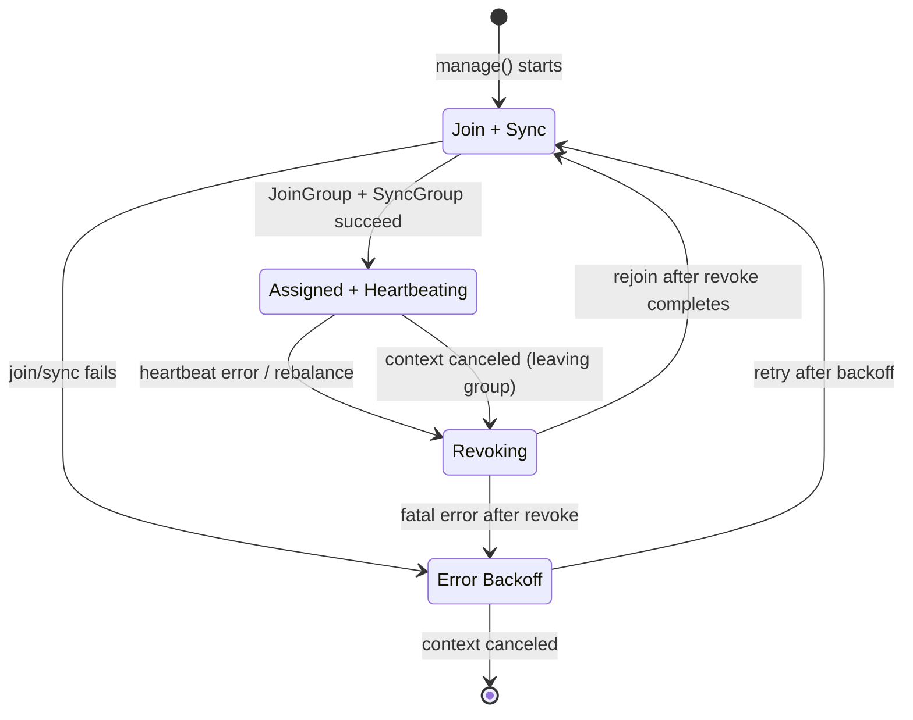

Walking through a normal lifecycle:

**1. Join and Sync** (`joinAndSync`): the client sends JoinGroup to the broker.
If elected leader, it runs the configured balancer to assign partitions to all
group members, then sends the result in SyncGroup. All members receive their
assignments from SyncGroup.

**2. Setup and heartbeat** (`setupAssignedAndHeartbeat`): after joining, the
client:
- Computes which partitions were added and which were lost (for cooperative
  consumers)
- Pre-revokes lost partitions (cooperative only)
- Calls the user's `OnPartitionsAssigned` callback
- Fetches committed offsets for the new partitions
- Begins consuming from those offsets
- Enters the heartbeat loop

**3. Heartbeat loop** (`heartbeat`): sends periodic HeartbeatRequest to tell
the broker we are alive. The broker responds with errors if a rebalance is
needed. The heartbeat loop also watches for:
- Fetch offset errors (from step 2, which runs concurrently)
- Forced rejoin signals (from metadata changes to subscribed topics)
- Context cancellation (client is closing)
- Forced heartbeats (from EOS before committing)

**4. Revoke** (`revoke`): when the heartbeat loop exits, the client must
revoke its partitions before rejoining. For eager consumers, ALL partitions
are revoked. For cooperative consumers, only the partitions that need to move
are revoked. The user's `OnPartitionsRevoked` callback is called, giving them
a chance to commit offsets.

### Eager vs. cooperative consumers

**Eager** (default pre-KIP-429): on every rebalance, ALL partitions are
revoked from ALL members. Then, after rejoining, partitions are reassigned.
This causes a brief period where no one is consuming anything.

**Cooperative** (KIP-429): only the partitions that are actually moving between
members are revoked. Everyone else keeps consuming uninterrupted. The client
handles this with `diffAssigned()`, which computes the difference between the
last assignment and the new one.

### Lock ordering

The consumer and group consumer have interacting mutexes. To prevent deadlocks,
they must always be acquired in this order:

```
consumer.mu  =>  groupConsumer.mu
```

If you need both locks, acquire `consumer.mu` first. Never acquire
`consumer.mu` while holding `groupConsumer.mu`.

What each lock protects:
- `consumer.mu`: the set of active cursors (`usingCursors`), session state
- `groupConsumer.mu`: uncommitted offset tracking, group state

---

## Transactions

Kafka supports exactly-once semantics (EOS) through transactions. A
transaction groups produces and offset commits into an atomic unit: either all
are committed or all are rolled back. The typical pattern is ETL - consume
records, transform, produce results, commit input offsets, end transaction.

### Transaction lifecycle

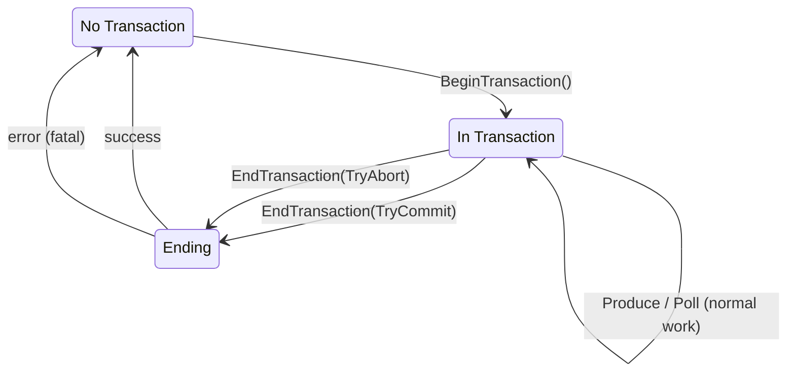

### GroupTransactSession

For the common ETL pattern (consume-transform-produce in a group),
`GroupTransactSession` wraps the client with safety rails:

The key problem: if a rebalance happens while you are producing inside a
transaction, you must abort. If you commit, you might commit records that
another group member is also producing (because the partition was reassigned).

`GroupTransactSession` solves this by hooking `OnPartitionsRevoked` and
`OnPartitionsLost`. If either fires before `End(TryCommit)`, the commit is
automatically converted to an abort.

### Producer IDs and epochs

Every idempotent/transactional producer has a **producer ID** (a 64-bit int)
and an **epoch** (a 16-bit int). These are assigned by the broker via
`InitProducerID`. The ID is long-lived; the epoch is bumped when:

- A new transaction is started (transactional)
- The producer needs to recover from an error (KIP-360)
- EndTxn is processed (KIP-890)

The ID and epoch are sent with every produce request. The broker uses them for:
- **Idempotent deduplication**: the broker rejects duplicate batches with the
  same (ID, epoch, sequence number) tuple
- **Transaction fencing**: if a new producer with the same transactional ID
  gets a higher epoch, the old producer is fenced and can no longer produce

### AddPartitionsToTxn

Before produce request v12, the client must explicitly tell the broker which
partitions are part of the current transaction via `AddPartitionsToTxn`. This
happens automatically: the first time a partition is produced to within a
transaction, the client sends `AddPartitionsToTxn` before (or alongside) the
produce request.

With produce v12+ (KIP-890 phase 2), this is implicit - the broker
automatically adds partitions to the transaction when it sees a produce request
with a transactional ID.

---

## Metadata

### Why metadata matters

Every produce and consume operation needs to know which broker is the leader
for a given partition. This mapping changes over time (brokers restart, load
balancing, etc.). The metadata loop keeps this mapping current.

### The metadata loop

A single dedicated goroutine runs the metadata loop for the lifetime of the
client:

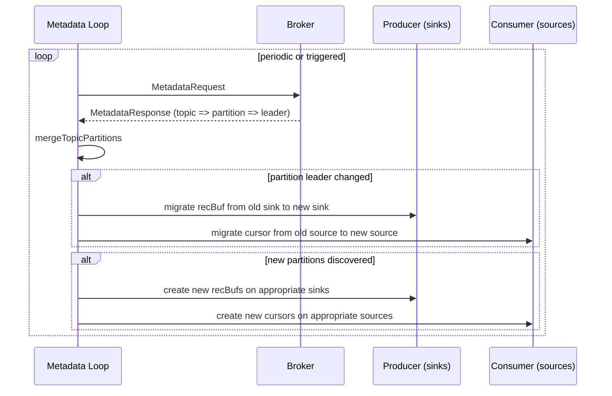

The metadata loop can be triggered in three ways:

1. **Periodic**: every `metadataMaxAge` (default 5 minutes)
2. **Non-urgent**: `triggerUpdateMetadata` - respects `metadataMinAge` to avoid
   hammering the broker. Used after retryable errors.
3. **Immediate**: `triggerUpdateMetadataNow` - bypasses the min-age check.
   Used when the client needs metadata NOW (first produce to a new topic,
   partition leader error, etc.)

There is also `blockingMetadataFn`, which runs a function atomically within
the metadata loop. This is used for operations like `PurgeTopics` that need
to happen between metadata refreshes without racing.

### mergeTopicPartitions

This is the core function that reconciles the metadata response with the
client's internal state. It has two phases:

**Phase 1: Existing partitions.** For each partition we already know about,
check if the leader changed. If it did, trigger a migration (move the recBuf
or cursor to the new leader's sink/source). If the partition has a load error
(e.g., leader not available), record it in `retryWhy`.

**Phase 2: New partitions.** For each partition we see for the first time,
create a new recBuf (if producing) or cursor (if consuming) and assign it to
the appropriate sink/source.

On first metadata load for a topic, only phase 2 runs (there are no existing
partitions). Both phases must populate `retryWhy` to drive the retry loop -
if any partition has a transient error, the metadata loop will retry up to 8
times at ~250ms intervals before falling back to the normal refresh interval.

### Partition migration

When a partition leader changes, the client must move the recBuf or cursor
from the old broker's sink/source to the new broker's sink/source. For
producing, this is `migrateProductionTo`:

1. Remove the recBuf from the old sink
2. Lock the recBuf and update its sink pointer and partition data
3. Add the recBuf to the new sink

During step 1-2, new records may still be produced to this recBuf and trigger
drains on the old sink. That is harmless - the old sink will simply not find
the recBuf in its list.

### Cached metadata

For admin-style operations (e.g., kadm), `RequestCachedMetadata` provides a
caching layer that avoids redundant metadata requests:

- Topics are cached with timestamps and evicted when stale
- TopicID-to-name mapping is maintained for Kafka 3.1+ (which uses topic IDs
  in some protocols)
- The cache does NOT populate AuthorizedOperations (admin users who need auth
  ops bypass the cache)

---

## Broker Connections

### Connection types

Each broker maintains up to five independent TCP connections:

| Connection | Used for | Why separate |
|-----------|----------|--------------|
| `cxnProduce` | Produce requests | Avoids head-of-line blocking from other requests |
| `cxnFetch` | Fetch requests | Fetch can block for `maxWait` (seconds); must not block other RPCs |
| `cxnGroup` | JoinGroup, SyncGroup | Can block for minutes during rebalance |
| `cxnSlow` | Any timeout-bearing request | Long-running operations |
| `cxnNormal` | Everything else | General purpose |

Without this separation, a long-running fetch (waiting for data) could block a
produce request from being sent, or a JoinGroup that takes 30 seconds could
block metadata requests.

Connections are reaped after `connIdleTimeout` of inactivity (no reads or
writes).

### Request pipelining

Multiple requests can be in-flight on a single connection simultaneously. The
broker processes them in order, and the client reads responses in order. This
pipelining improves throughput by not waiting for each response before sending
the next request.

The `resps` ring on each `brokerCxn` manages the ordering: each request pushes
a `promisedResp` onto the ring, and the response reader pops them in order.

**Important implication for error handling:** if any request on a pipelined
connection fails (context canceled, network error), the entire connection dies.
All other in-flight requests on that connection receive `errChosenBrokerDead`.
This is why the produce path must handle `errChosenBrokerDead` as a retryable
error - it does not mean the batch was rejected, it means we do not know what
happened.

### I/O and context cancellation

Both `writeConn` and `readConn` spawn a short-lived goroutine to perform
blocking I/O, then use a `select` to race the I/O completion against context
cancellation:

```go
writeDone := make(chan struct{})
go func() {
    defer close(writeDone)
    bytesWritten, writeErr = cxn.conn.Write(buf)
}()
select {
case <-writeDone:
    // normal completion
case <-ctx.Done():
    // cancel: force the connection to unblock by setting a past deadline
    cxn.conn.SetWriteDeadline(time.Now())
    <-writeDone
}
```

This pattern is necessary because Go's `net.Conn.Write/Read` are blocking and
not directly cancelable by context. Setting the deadline to `time.Now()` causes
the blocked I/O to return immediately with a deadline-exceeded error, which is
then replaced with the context error.

---

## Concurrency Patterns

The client uses several custom concurrency primitives instead of standard
channels or permanent goroutines. Understanding these patterns is essential
before modifying the code.

### workLoop (`atomic_maybe_work.go`)

**Problem:** many parts of the client have a "maybe do work" trigger. For
example, "maybe start draining this sink" or "maybe start fetching from this
source." Using channels for this requires a permanent goroutine to drain the
channel. Using a mutex+condition requires careful signaling.

**Solution:** `workLoop` is a three-state atomic state machine:

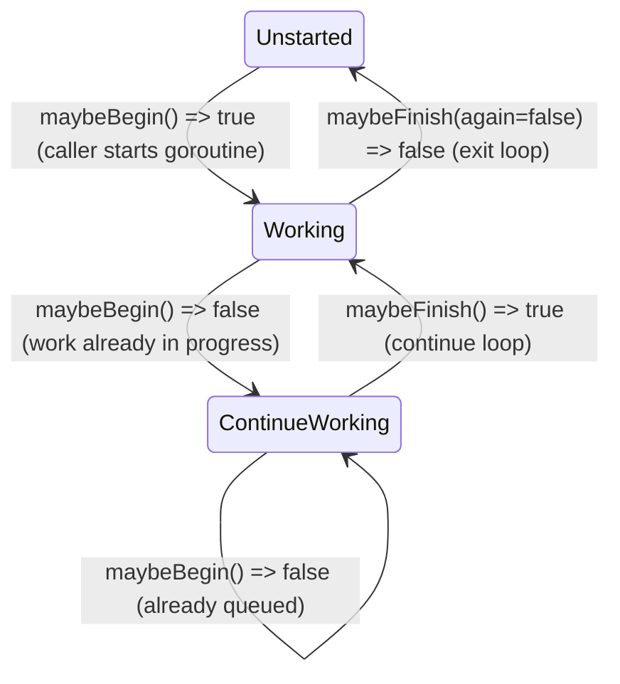

How it works:
- `maybeBegin()` tries to transition from Unstarted to Working. If successful,
  the caller starts a goroutine to do the work. If the state was already
  Working, it transitions to ContinueWorking (marking that more work arrived).
- `maybeFinish(again)` is called at the end of each work iteration. If the
  state is ContinueWorking, it demotes to Working and returns true (keep going).
  If the state is Working and `again` is false, it transitions to Unstarted and
  returns false (stop).

This gives us: at most one goroutine running at a time, no work is missed
(thanks to ContinueWorking), and the goroutine exits when idle (no permanent
goroutine cost).

Used by: `sink.drainState`, `source.fetchState`,
`consumer.outstandingMetadataUpdates`.

### ring (`ring.go`)

**Problem:** we need a queue where producers push items and a worker processes
them in order. A channel works, but requires a permanent goroutine to drain it
(you cannot start a goroutine on first push without racing with itself).

**Solution:** a ring buffer where the pusher starts the worker goroutine when
it pushes the first element, and the worker exits when the ring is empty.

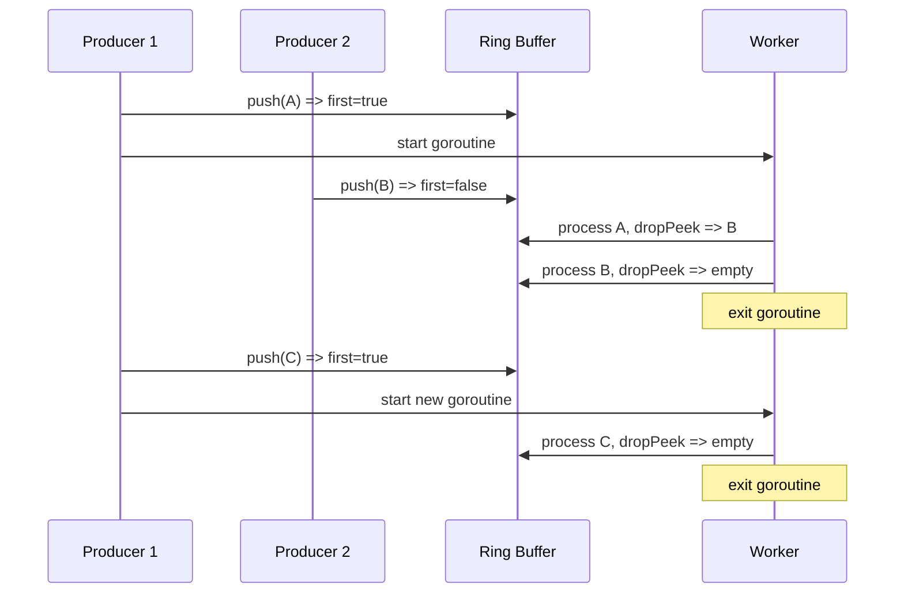

The ring uses a fixed-size 8-element array for the common case (no allocation
after initialization) with overflow to a slice for bursts. The `die()` method
prevents further pushes, which is used when shutting down to ensure no new
work is accepted.

Used by: `sink.seqResps` (ordered produce responses), `producer.batchPromises`
(callback delivery), `brokerCxn.resps` (ordered response reading).

### Cursor useState (`source.go`)

An `atomic.Bool` that gates whether a cursor can be used in a fetch request.
See [Cursors: tracking where we are](#cursors-tracking-where-we-are) for the
state diagram and [Things That Will Bite You](#consume-side) for the ordering
rules. The short version:

```go
func (c *cursor) allowUsable() {
    s := c.source         // read BEFORE Swap
    c.useState.Swap(true) // cursor is now live - do not touch fields after this
    s.maybeConsume()      // wake the correct source
}
```

**Remove, modify, Swap(true), add.** Never modify after Swap. Never add before
Swap.

---

## File Map

| File | What it does | Key types/functions |
|------|-------------|-------------------|
| `client.go` | Client initialization, sharded request fan-out, cached metadata, coordinator discovery | `Client`, `shardedRequest`, `RequestCachedMetadata` |
| `config.go` | All configuration options (200+ options) | `Opt`, `cfg` |
| `broker.go` | TCP connection management, request/response I/O, SASL auth | `broker`, `brokerCxn`, `writeConn`, `readConn` |
| `sink.go` | Produce buffering, batching, drain loop, produce request building, response handling | `sink`, `recBuf`, `recBatch`, `produceRequest` |
| `source.go` | Fetch request building, response parsing, cursor management, record decompression | `source`, `cursor`, `fetchRequest`, `fetchSession` |
| `producer.go` | `Produce()` entry point, flush, backpressure, unknown topic handling, promise delivery | `producer`, `Produce`, `Flush` |
| `consumer.go` | Consumer session management, `PollFetches`, partition assignment, offset management | `consumer`, `consumerSession`, `Offset` |
| `consumer_group.go` | Group join/sync/heartbeat, rebalance, cooperative/eager, offset commits | `groupConsumer`, `manage`, `heartbeat` |
| `consumer_group_848.go` | KIP-848 (new) consumer group protocol | `manage848` |
| `consumer_direct.go` | Direct (non-group) partition assignment | `directConsumer` |
| `metadata.go` | Metadata loop, partition merging, topic/partition creation and migration | `updateMetadataLoop`, `mergeTopicPartitions` |
| `txn.go` | `GroupTransactSession`, exactly-once semantics, EndTransaction | `GroupTransactSession`, `End` |
| `record_and_fetch.go` | Public `Record`, `Fetch`, `Fetches` types, iteration helpers | `Record`, `Fetches`, `FetchesRecordIter` |
| `topics_and_partitions.go` | Internal topic/partition tracking, migration helpers | `topicPartition`, `migrateProductionTo` |
| `compression.go` | Compression/decompression with sync.Pool reuse | `compressor`, `decompressor` |
| `partitioner.go` | Partitioning strategies (round-robin, hash, sticky, etc.) | `Partitioner`, `StickyKeyPartitioner` |
| `hooks.go` | Hook interface definitions for observability | `Hook`, `HookProduceBatchWritten`, etc. |
| `errors.go` | Error types and helpers | `ErrDataLoss`, `ErrRecordTimeout`, etc. |
| `atomic_maybe_work.go` | `workLoop` state machine, `lazyI32` atomic helper | `workLoop` |
| `ring.go` | MPSC ring buffer (replaces channels) | `ring[T]` |
| `pools.go` | Record/header allocation pool interfaces for zero-alloc consuming | `Pool`, `PoolRecords` |
| `record_formatter.go` | Printf-style record formatting | `RecordFormatter` |
| `metrics_714.go` | Prometheus-compatible metrics via hooks | Various metric types |

---

## Things That Will Bite You

This section lists non-obvious invariants that have caused bugs in the past.
If you are modifying the code, check whether your change violates any of these.

### Produce side

- **Sequence numbers are per-partition, not per-request.** If a batch is
  retried on a different sink (because the leader moved), it keeps its
  original sequence number. `recBuf.seq` tracks this, and `batch0Seq` records
  the sequence at the start of the buffer so we can reset on retry.

- **`recBuf.batches[0]` is special.** Most produce response logic only operates
  on the first batch in a recBuf. This is because batches must complete in
  order - you cannot finish batch 2 before batch 1. If a response references
  a batch that is not the first, it is skipped.

- **`failAllRecords` locks batches individually.** When failing all records in
  a recBuf, each batch's mutex must be acquired separately because a
  concurrent `produceRequest.AppendTo` might be reading the batch for
  serialization. The recBuf mutex alone is not sufficient.

- **The producer ID must be loaded BEFORE creating the request.** If a prior
  produce response triggered `errReloadProducerID`, then `producerID()` sets
  `needSeqReset`, and creating the request (which reads `needSeqReset`) must
  happen after. If you swap this order, the request will use old sequence
  numbers with a new producer ID, causing Out Of Order Sequence Number errors.

### Consume side

- **After `useState.Swap(true)`, the cursor is live.** Any field read or write
  after this point races with a concurrent fetch. This has caused real bugs
  (see #1167).

- **`move()` must be: remove, modify, Swap(true), add.** All field writes
  must happen before the Swap (which publishes availability). The add must
  happen after the Swap (which makes the cursor fetchable). Between remove
  and add, no source has the cursor, so no concurrent fetch can pick it up.

- **Fetch sessions are per-source, not per-client.** Each broker tracks its
  own session state. Resetting one source's session does not affect others.

- **`handleReqResp` runs inside a live consumer session.** It reads cursor
  fields that metadata updates also modify. This is safe only because metadata
  updates stop the session before modifying cursors.

### Group consumer

- **`onAssigned` and `onRevoked` never run concurrently.** The
  `assignRevokeSession` ensures this. If you add a new path that calls user
  callbacks, you must go through this mechanism.

- **Heartbeating starts before offsets are fetched.** This is intentional -
  the broker needs heartbeats to know we are alive. But it means fetch offset
  errors can arrive while heartbeating, and the heartbeat loop must handle
  them.

- **In kfake, `group.manage()` must NEVER call `c.admin()`.** This would
  deadlock between `group.manage()` and `Cluster.run()`. This constraint
  is kfake-specific but worth noting because kfake tests exercise these paths.

### Metadata

- **`mergeTopicPartitions` has two loops, both matter.** The existing-partitions
  loop and the new-partitions loop must both check `loadErr` and populate
  `retryWhy`. Missing this in the new-partitions loop caused a real bug
  (40c144d3).

- **Migration happens under `recBuf.mu`.** Between removing a recBuf from the
  old sink and adding it to the new one, records can still be buffered to the
  recBuf. This is safe - the old sink no longer has the recBuf in its list,
  so wasted drain triggers are harmless. The new sink picks it up after add.

### Connections

- **Pipelined request cancellation kills the connection.** If you cancel a
  context for one request, the connection's write/read deadline is set to
  `time.Now()`, which kills ALL in-flight requests on that connection. Other
  requests get `errChosenBrokerDead`, which is retryable. This is by design
  but can cause surprising retry storms.

- **`errChosenBrokerDead` does NOT mean the broker is actually dead.** It
  means the connection died, often because another request on the same
  connection was canceled. The broker may have processed the request
  successfully. For produce requests, this means `unsureIfProduced` must be
  set because we cannot know if the batch was persisted.
