# franz-go internals

How the kgo package is put together: what the main paths do, which goroutines
own what, and the invariants that have bitten us before. You should know Go
concurrency and the basics of Kafka (topics, partitions, brokers, groups).

## Architecture

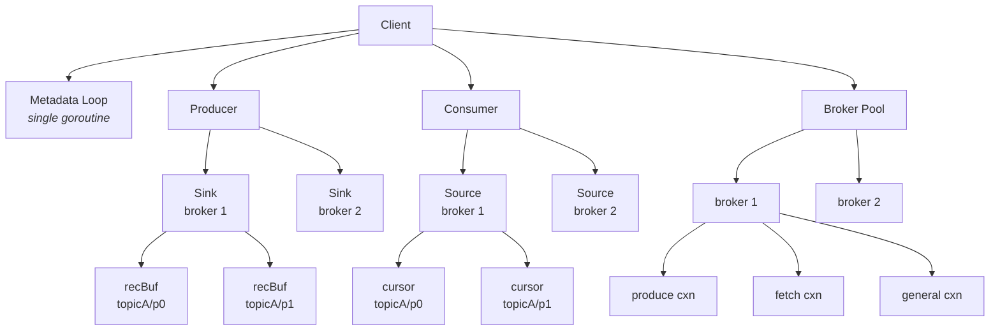
```mermaid
graph TB
    Client[Client]
    Client --> MetadataLoop[Metadata Loop<br/><i>single goroutine</i>]
    Client --> Producer[Producer]
    Client --> Consumer[Consumer]
    Client --> BrokerPool[Broker Pool]

    Producer --> Sink1[Sink<br/>broker 1]
    Producer --> Sink2[Sink<br/>broker 2]

    Consumer --> Source1[Source<br/>broker 1]
    Consumer --> Source2[Source<br/>broker 2]

    Sink1 --> RB1[recBuf<br/>topicA/p0]
    Sink1 --> RB2[recBuf<br/>topicA/p1]

    Source1 --> C1[cursor<br/>topicA/p0]
    Source1 --> C2[cursor<br/>topicA/p1]

    BrokerPool --> B1[broker 1]
    BrokerPool --> B2[broker 2]
    B1 --> Cxn1[produce cxn]
    B1 --> Cxn2[fetch cxn]
    B1 --> Cxn3[general cxn]
```

- `Client` (`client.go`) owns everything: the broker pool, the metadata loop,
  and the optional producer and consumer.
- A `sink` (`sink.go`) is the produce side of one broker. It gathers the
  records destined for that broker and sends them in batched produce requests.
- A `source` (`source.go`) is the consume side of one broker. It issues fetch
  requests and buffers the results for polling.
- A `recBuf` (`sink.go`) buffers the records of one topic partition and is
  owned by a sink. A `cursor` (`source.go`) tracks where we are consuming one
  topic partition and is owned by a source. When a partition's leader changes,
  the metadata loop moves the recBuf or cursor to the new broker's sink or
  source; this is called migration and happens under locks.
- A `broker` (`broker.go`) manages the TCP connections to one Kafka broker,
  up to five of them, split by usage so that one workload cannot block
  another.

A share group consumer adds a parallel set of `shareCursor`s on each source.
The share path reuses the source and broker plumbing but speaks ShareFetch and
ShareAcknowledge and tracks per record ack state rather than an offset. See
[Share groups](#share-groups).

## Producing

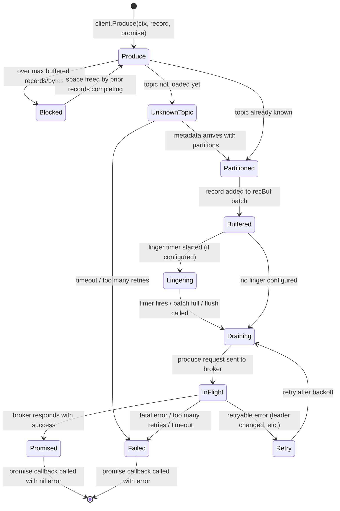
```mermaid
stateDiagram-v2
    [*] --> Produce: client.Produce(ctx, record, promise)
    Produce --> Blocked: over max buffered records/bytes
    Blocked --> Produce: space freed by prior records completing
    Produce --> UnknownTopic: topic not loaded yet
    UnknownTopic --> Partitioned: metadata arrives with partitions
    UnknownTopic --> Failed: timeout / too many retries
    Produce --> Partitioned: topic already known
    Partitioned --> Buffered: record added to recBuf batch
    Buffered --> Lingering: linger timer started (if configured)
    Lingering --> Draining: timer fires / batch full / flush called
    Buffered --> Draining: no linger configured
    Draining --> InFlight: produce request sent to broker
    InFlight --> Promised: broker responds with success
    InFlight --> Retry: retryable error (leader changed, etc.)
    InFlight --> Failed: fatal error / too many retries / timeout
    Retry --> Draining: retry after backoff
    Promised --> [*]: promise callback called with nil error
    Failed --> [*]: promise callback called with error
```

`Produce` (`producer.go`) checks the record has a topic and that we are in a
valid state (in a transaction, if transactional), then blocks if we are over
the configured maximum buffered records or bytes. That block is the only
backpressure.

`loadPartsAndPartition` looks up the topic's partitions. A topic we have not
loaded yet parks the record in the unknown topics holding area and triggers a
metadata refresh; when metadata arrives, held records are partitioned and
buffered. Otherwise the configured partitioner picks a partition and the record
goes to that partition's recBuf.

`bufferRecord` (`sink.go`) appends the record to the recBuf's last batch, or
starts a new batch when the last is over `maxRecordBatchBytes`. Then
`checkIfShouldDrainOrStartLinger` decides: with lingering configured and
exactly one non-full batch, start the linger timer; otherwise, or if a flush is
in progress, drain now. The timer lives on the recBuf, not the sink, because
partitions fill at different rates. The timer and its callback are reused
across cycles, and `isLingering` tracks whether it is armed, since a stopped
timer object persists.

The sink's `drain` loop backs off if the prior request failed, takes an
inflight slot, ensures we have a producer id (for idempotence), builds a
request from every recBuf's ready batches while staying under
`maxBrokerWriteBytes`, and sends it.

`handleReqResp` processes responses in order (below). Per partition: success
promises the batch's records with their offsets, a retryable error returns the
batch to its recBuf, and a fatal error promises the records with the error.

### Ordered responses

The idempotent producer numbers batches with sequences, so the sink must handle
responses in the order it sent requests: out of order handling would retry the
wrong batch and land OUT_OF_ORDER_SEQUENCE_NUMBER. Each sink keeps a `seqResp`
ring.

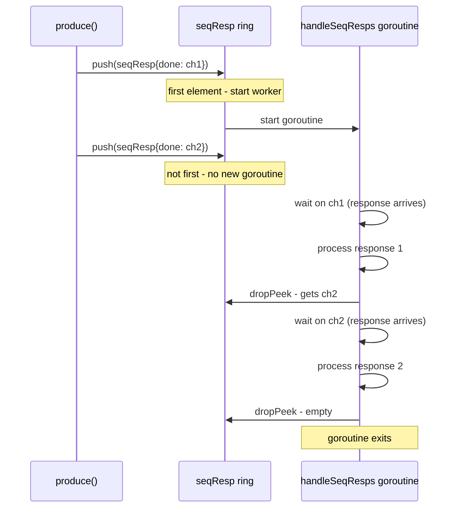
```mermaid
sequenceDiagram
    participant P as produce()
    participant R as seqResp ring
    participant H as handleSeqResps goroutine

    P->>R: push(seqResp{done: ch1})
    Note over R: first element - start worker
    R->>H: start goroutine
    P->>R: push(seqResp{done: ch2})
    Note over R: not first - no new goroutine

    H->>H: wait on ch1 (response arrives)
    H->>H: process response 1
    H->>R: dropPeek - gets ch2
    H->>H: wait on ch2 (response arrives)
    H->>H: process response 2
    H->>R: dropPeek - empty
    Note over H: goroutine exits
```

The push of the first element starts the worker, and the worker exits when the
ring empties, so no sink pays for a permanent goroutine. The same ring pattern
appears throughout the client; see [Concurrency](#concurrency).

### When a batch can fail

A non-idempotent client can fail any batch at any time. An idempotent client
can fail a batch only when `canFailFromLoadErrs` is true, meaning no produce
response is pending for it, and `unsureIfProduced` is false.

`unsureIfProduced` is set on REQUEST_TIMED_OUT and
NOT_ENOUGH_REPLICAS_AFTER_APPEND: the broker may or may not have persisted the
batch, so we must retry until we get a definite answer. `canFailFromLoadErrs`
is cleared while a request is in flight, so a metadata driven error bump cannot
cancel a batch the broker is in the middle of writing.

## Consuming

Fetching is double buffered: while you process one set of records, the source
is already fetching the next.

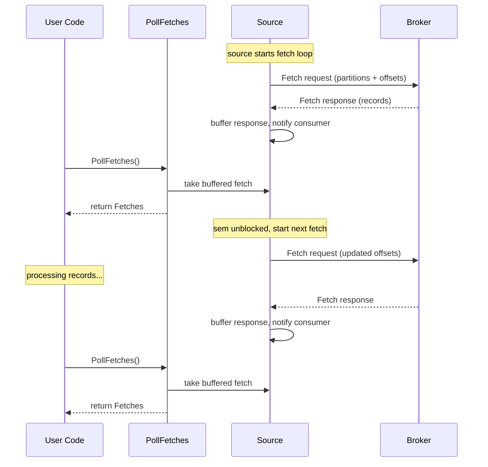
```mermaid
sequenceDiagram
    participant User as User Code
    participant Poll as PollFetches
    participant Src as Source
    participant Brk as Broker

    Note over Src: source starts fetch loop
    Src->>Brk: Fetch request (partitions + offsets)
    Brk-->>Src: Fetch response (records)
    Src->>Src: buffer response, notify consumer

    User->>Poll: PollFetches()
    Poll->>Src: take buffered fetch
    Poll-->>User: return Fetches
    Note over Src: sem unblocked, start next fetch
    Src->>Brk: Fetch request (updated offsets)
    Note over User: processing records...
    Brk-->>Src: Fetch response
    Src->>Src: buffer response, notify consumer

    User->>Poll: PollFetches()
    Poll->>Src: take buffered fetch
    Poll-->>User: return Fetches
```

### Cursors

A cursor tracks the next offset to fetch, the last consumed epoch (for KIP-320
truncation detection), and the partition's high watermark. Its `useState`
atomic bool gates whether it can go into a fetch request:

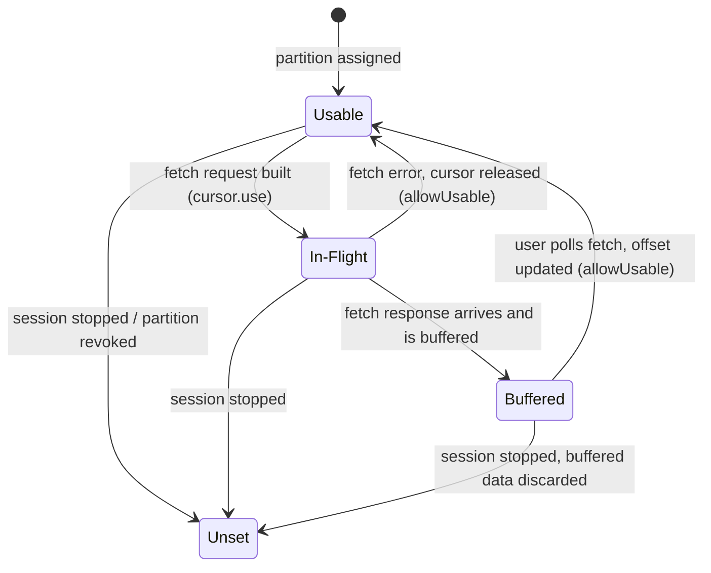
```mermaid
stateDiagram-v2
    state "Usable" as U
    state "In-Flight" as IF
    state "Buffered" as B
    state "Unset" as UN

    [*] --> U: partition assigned
    U --> IF: fetch request built (cursor.use)
    IF --> B: fetch response arrives and is buffered
    IF --> U: fetch error, cursor released (allowUsable)
    B --> U: user polls fetch, offset updated (allowUsable)
    U --> UN: session stopped / partition revoked
    IF --> UN: session stopped
    B --> UN: session stopped, buffered data discarded
```

An atomic rather than a mutex because publishing availability must be one
operation that the fetch loop can check without holding a lock across the
fetch lifecycle. The consequence is the one rule this package's races come
from: after `allowUsable` swaps `useState` to true, a concurrent fetch may
already be using the cursor. Read what you need before the swap, write nothing
after it, and always remove, modify, swap, add. See the comment on
`cursorOffsetPreferred.move` in source.go and #1167.

### Fetch sessions (KIP-227)

Without sessions every fetch carries every partition and offset. With them the
broker remembers what we last asked for, we send only partitions whose offsets
changed, and the broker returns only partitions with new data. Session state is
per source in `fetchSession`: `used` maps each partition to the last sent
offset and epoch, every response updates it, and a partition removed from the
source goes into the next request's forgotten topics. If the broker evicts our
session it answers FETCH_SESSION_ID_NOT_FOUND and we start over with a full
fetch.

### Preferred replicas (KIP-392)

A fetch response can name a preferred replica. We move the cursor to that
broker's source, note the time in `moveAt`, and every
`RecheckPreferredReplicaInterval` move back to the leader to see whether the
preference still holds.

## Consumer sessions

A consumer session is what lets us stop all fetching, drop buffered data, and
start over when the assignment changes, atomically rather than one source at a
time. `stopSession` does, in order: cancel the session context so in-flight
fetches return; store `noConsumerSession` so no source starts a new fetch loop;
wait for every fetch, list offsets, and epoch load worker to exit; reset every
fetch session; discard buffered fetches, which returns cursors to their
pre-fetch offsets; and hand pending offset loads to the next session. Each step
relies on the one before it. `sessionChangeMu` keeps a metadata update from
changing assignments while a session is mid stop or start.

## Group consumers

We implement both group protocols and pick at startup (`should848` in
`consumer_group_848.go`):

- Classic (`manage` in `consumer_group.go`): JoinGroup and SyncGroup. The
  leader runs the configured balancer and ships assignments through
  SyncGroup; Heartbeat is its own RPC.
- KIP-848 (`manage848`): one ConsumerGroupHeartbeat carries member info,
  subscription, and assignment ack, and the broker assigns. We pick the
  server side assignor (`uniform` for sticky, `range` for range) from your
  `Balancers` option. Always cooperative.

If the first heartbeat returns UnsupportedVersion, `manage848` hands off to
`manage` for the rest of the group session. The rest of this section is the
classic flow; 848 has the same shape collapsed into the heartbeat.

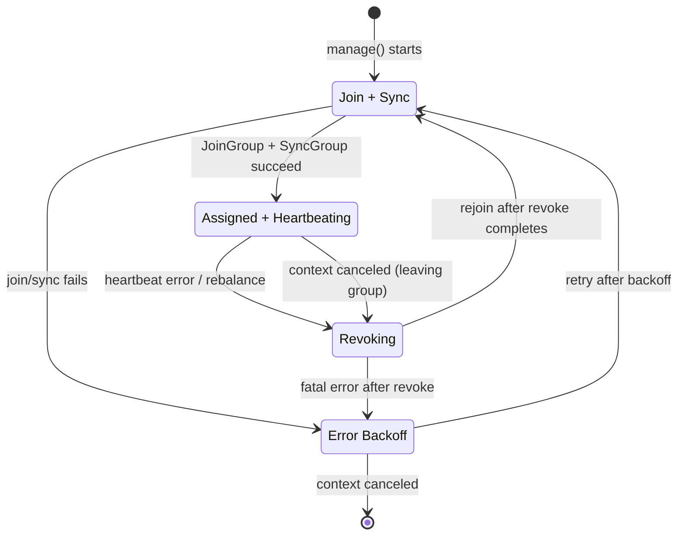
```mermaid
stateDiagram-v2
    state "Join + Sync" as JS
    state "Assigned + Heartbeating" as AH
    state "Revoking" as R
    state "Error Backoff" as EB

    [*] --> JS: manage() starts
    JS --> AH: JoinGroup + SyncGroup succeed
    AH --> R: heartbeat error / rebalance
    AH --> R: context canceled (leaving group)
    R --> JS: rejoin after revoke completes
    JS --> EB: join/sync fails
    EB --> JS: retry after backoff
    R --> EB: fatal error after revoke
    EB --> [*]: context canceled
```

`joinAndSync` joins, balances if we are the leader, and syncs.
`setupAssignedAndHeartbeat` diffs the new assignment against the old, pre
revokes lost partitions (cooperative only), calls `OnPartitionsAssigned`,
fetches committed offsets, starts consuming, and enters `heartbeat`. The
heartbeat loop also watches for fetch offset errors, forced rejoins from
metadata changes to subscribed topics, forced heartbeats before a
transactional commit, and cancellation. When it exits, `revoke` gives up
partitions before rejoining: everything for eager consumers, only what moves
for cooperative ones (`diffAssigned`), calling `OnPartitionsRevoked` so you
can commit.

Eager versus cooperative applies only to classic. Eager (the pre KIP-429
default) revokes every partition from every member on every rebalance, so
nobody consumes for a moment. Cooperative (KIP-429) revokes only the
partitions that move.

With a `Rack` configured, the sticky and range balancers prefer partitions
whose leader is in our rack (KIP-881); `buildPartitionRacks` in
`group_balancer.go` builds the topic, partition, rack map once per balance.
848 forwards `RackID` and lets the broker do the same.

Lock ordering is `consumer.mu` then `groupConsumer.mu`, never the reverse.
`consumer.mu` guards the active cursors and session state; `groupConsumer.mu`
guards uncommitted offsets and group state.

## Share groups

A share group (KIP-932, Kafka 4.0+) assigns each consumer a subset of the
subscription's partitions, but many consumers can read the same partition at
once. Each record is acquired under a broker side lock, acknowledged
individually, and redelivered if the lock expires first. It suits queue
workloads where one slow record should not hold a partition for everyone.

```
                 Classic consumer group       Share group
                 ----------------------       -----------
Assignment       Whole partitions, one        Subset of partitions, but
                 consumer per partition.      a partition can be shared
                                              across many consumers.
Position         One offset per partition.    No client-side offset; broker
                                              tracks per-record state.
Ack model        Bulk: commit the next        Per-record: each fetched record
                 offset to read.              is accepted/released/rejected
                                              individually (or renewed).
Redelivery       Only on consumer failure +   Automatic when the broker's
                 rebalance.                   acquisition lock expires.
Order            In-partition order.          Best-effort; release re-queues.
RPCs             Fetch / OffsetCommit.        ShareFetch / ShareAcknowledge,
                                              sent to partition leaders like
                                              Fetch (not to a coordinator); the
                                              broker tracks per-record state
                                              via the share-state coordinator.
Group protocol   Classic or KIP-848.          ShareGroupHeartbeat (KIP-932),
                                              same shape as 848.
```

The model differs enough that `shareConsumer` (`consumer_share.go`) is its own
type beside `consumer`. It reuses the broker pool, the source per broker, the
fetchManager, the metadata loop, and the ring and workLoop primitives; it does
not use `cursor`, `consumerSession`, or any offset commit machinery.

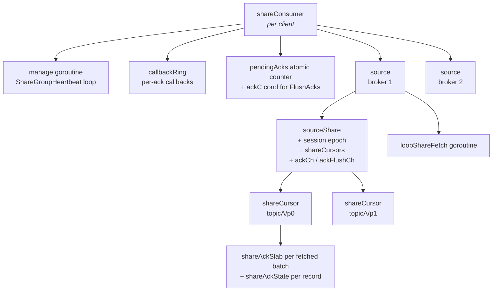
```mermaid
graph TB
    SC[shareConsumer<br/><i>per client</i>]
    SC --> Manage[manage goroutine<br/>ShareGroupHeartbeat loop]
    SC --> CallbackRing[callbackRing<br/>per-ack callbacks]
    SC --> AckCounter[pendingAcks atomic counter<br/>+ ackC cond for FlushAcks]

    SC --> Src1[source<br/>broker 1]
    SC --> Src2[source<br/>broker 2]

    Src1 --> SS1[sourceShare<br/>+ session epoch<br/>+ shareCursors<br/>+ ackCh / ackFlushCh]
    Src1 --> LSF1[loopShareFetch goroutine]

    SS1 --> ShC1[shareCursor<br/>topicA/p0]
    SS1 --> ShC2[shareCursor<br/>topicA/p1]

    ShC1 --> Slab[shareAckSlab per fetched batch<br/>+ shareAckState per record]
```

Each source carries a `sourceShare`: `sessionEpoch` (0 new, incremented per
successful response, -1 closing), `sessionParts` (what the broker thinks is in
the session; `createShareFetchReq` diffs the wanted set against it to build the
add and forget lists), `cursors` (the share cursors whose leader is this
broker; they migrate between sources like classic cursors, but on a
`CurrentLeader` hint in a ShareFetch response rather than a metadata refresh),
and `ackCh` and `ackFlushCh`, which wake the per source `loopShareFetch` for
"acks pending" and "flush them now".

Each `shareCursor` has `assigned`, flipped by the manage loop as the broker
hands us or takes the partition, and `pendingAcks` and `pendingGaps`, the
outbound queues. Unlike `useState`, `assigned` is not toggled around request
build: the fetchManager plus the single threaded `loopShareFetch` already
serialize fetches.

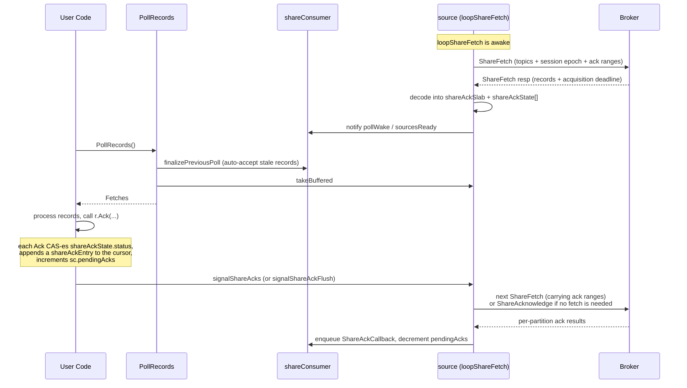
```mermaid
sequenceDiagram
    participant User as User Code
    participant Poll as PollRecords
    participant SC as shareConsumer
    participant Src as source (loopShareFetch)
    participant Brk as Broker

    Note over Src: loopShareFetch is awake
    Src->>Brk: ShareFetch (topics + session epoch + ack ranges)
    Brk-->>Src: ShareFetch resp (records + acquisition deadline)
    Src->>Src: decode into shareAckSlab + shareAckState[]
    Src->>SC: notify pollWake / sourcesReady

    User->>Poll: PollRecords()
    Poll->>SC: finalizePreviousPoll (auto-accept stale records)
    Poll->>Src: takeBuffered
    Poll-->>User: Fetches

    User->>User: process records, call r.Ack(...)
    Note over User: each Ack CAS-es shareAckState.status,<br/>appends a shareAckEntry to the cursor,<br/>increments sc.pendingAcks
    User->>Src: signalShareAcks (or signalShareAckFlush)

    Src->>Brk: next ShareFetch (carrying ack ranges)<br/>or ShareAcknowledge if no fetch is needed
    Brk-->>Src: per-partition ack results
    Src->>SC: enqueue ShareAckCallback, decrement pendingAcks
```

`AckAccept` advances the broker past the record, `AckRelease` returns it for
redelivery, `AckReject` archives it, and `AckRenew` (KIP-1222, Kafka 4.2+)
extends the lock without completing. A renew does not survive the next
`PollRecords`: `finalizePreviousPoll` auto accepts anything still renewed or
unset. On close, anything still renewed is released so another consumer gets
it without waiting for the lock to expire.

`r.Ack` is lock free: a CAS on the record's `shareAckState.status` (a terminal
status overrides a renew, never another terminal; a renew needs the zero
state), then an append to the cursor's `pendingAcks` under `ackMu`, a
`pendingAcks++` on the consumer, and a non blocking wake of the source. When
the source builds its next ShareFetch, or a ShareAcknowledge when nothing needs
fetching, it drains each cursor's acks, dedupes by offset so a renew followed
by an accept becomes one terminal range (duplicate batches at one offset are
rejected with INVALID_RECORD_STATE), and serializes compact ranges. Each
entry's `(source, sessionEpoch)` is a staleness filter: if the session reset or
the cursor migrated since decode, the broker already released the lock, so the
ack is dropped. Results land on `sc.callbackRing`, the same ring and spawn on
empty pattern as `producer.batchPromises`; the drainer runs your
`ShareAckCallback` and only then subtracts from `pendingAcks`, so `FlushAcks`
waits for your callbacks, not just the broker.

A ShareFetch response can carry a `CurrentLeader` per partition. `applyMoves`
applies it under `blockingMetadataFn`, seeding the broker from the response's
`NodeEndpoints` if we have not met it, and migrates the cursor without a
metadata round trip.

The share `manage` loop mirrors `manage848`: a client generated member UUID at
epoch 0; heartbeats at the broker's interval, sending `SubscribedTopicNames`
and `RackID` only when they change (and again after any error); a new
assignment flips `assigned` on the affected cursors and wakes their sources.
UnknownMemberID or FencedMemberEpoch keeps the UUID, like the Java client, but
rejoins at epoch 0, drops the assignment, and resets every source's session.
Retryable errors back off; unknown errors surface a fake `ErrGroupSession` to
the poll path and fire `HookGroupManageError` without dropping the assignment,
since the broker may still consider us assigned and dropping it early churns.

`shareConsumer.leave` sets `dying` and cancels `fm.ctx`, waits on `sc.cond`
for `workers == 0`, releases unacked `lastPolled` records under `c.mu`, runs
`closeShareSession` on every source in parallel (release buffered but unpolled
records, then a final epoch ShareAcknowledge carrying the remaining
`pendingAcks`), and sends a leave heartbeat with `MemberEpoch = -1`, recording
any failure on `sc.leaveErr` without blocking close.

## Transactions

A transaction makes produces and offset commits atomic. The common shape is
ETL: consume, transform, produce, commit the input offsets, end the
transaction. `GroupTransactSession` wraps the client for that shape: a
rebalance mid transaction means another member may now own your input
partitions, so it hooks `OnPartitionsRevoked` and `OnPartitionsLost` and turns
`End(TryCommit)` into an abort if either fired.

Every idempotent or transactional producer has a 64-bit producer id and a
16-bit epoch from InitProducerID. The epoch bumps when a transaction starts,
when we recover from an error (KIP-360), and on EndTxn (KIP-890). Both go on
every produce request: the broker dedupes on (id, epoch, sequence), and a
newer epoch under the same transactional id fences the old producer.

Before produce v12 we send AddPartitionsToTxn the first time a transaction
produces to a partition. With v12 (KIP-890 phase 2) the broker adds partitions
itself.

KIP-939 (two phase commit participation) is designed but not built; the wire
version is still unstable and the resume path is stubbed. See
[`future/KIP939-2PC.md`](future/KIP939-2PC.md) before starting it.

## Metadata

One goroutine runs the metadata loop for the life of the client.

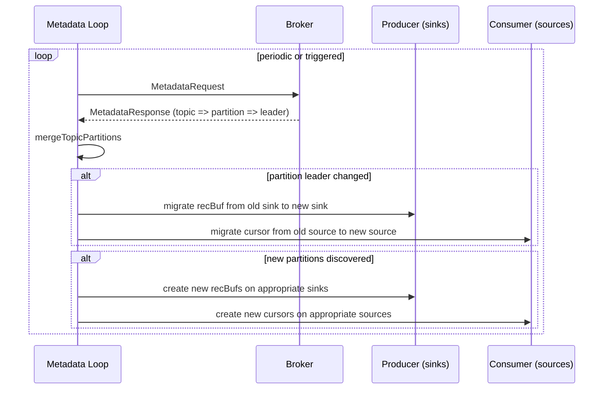
```mermaid
sequenceDiagram
    participant ML as Metadata Loop
    participant Brk as Broker
    participant Prod as Producer (sinks)
    participant Cons as Consumer (sources)

    loop periodic or triggered
        ML->>Brk: MetadataRequest
        Brk-->>ML: MetadataResponse (topic => partition => leader)
        ML->>ML: mergeTopicPartitions
        alt partition leader changed
            ML->>Prod: migrate recBuf from old sink to new sink
            ML->>Cons: migrate cursor from old source to new source
        end
        alt new partitions discovered
            ML->>Prod: create new recBufs on appropriate sinks
            ML->>Cons: create new cursors on appropriate sources
        end
    end
```

It runs every `metadataMaxAge` (default five minutes), on
`triggerUpdateMetadata`, which respects `metadataMinAge` and is used after
retryable errors, and on `triggerUpdateMetadataNow`, which does not wait and
is used when we need metadata now: a first produce to a topic, a leader error.
`blockingMetadataFn` runs a function inside the loop between refreshes, which
is how `PurgeTopics` avoids racing an update.

`mergeTopicPartitions` reconciles a response with what we hold. For every
partition we already know, it checks whether the leader changed and migrates
the recBuf or cursor if so, and records any load error in `retryWhy`. For
every partition we see for the first time, it creates the recBuf or cursor on
the right sink or source. Both loops must populate `retryWhy`: it drives up
to eight retries at about 250ms before the loop falls back to the normal
interval.

Migrating production (`migrateProductionTo`) removes the recBuf from the old
sink, updates its sink pointer and partition data under `recBuf.mu`, and adds
it to the new sink. Records buffered in between may trigger drains on the old
sink, which no longer lists the recBuf, so those triggers are wasted and
harmless.

### Topic recreation

A topic deleted and recreated under the same name comes back with a new topic
ID, and the merge handles it before the epoch rewind guard, since a new
incarnation legitimately restarts at epoch 0.

An ID we have held for `recreationStableIDAge` (`idAgreedAt`) whose metadata
now differs is believed outright: staleness is a seconds scale phenomenon. A
cursor with no position yet is the exception and waits for a broker rejection;
swapped early, a racing old incarnation committed offset would be applied to
the new topic rather than rejected (`cursor.positioned`). A younger ID needs
corroboration:

1. Gate armed (`recreationGate`: every connected broker speaks fetch v13). We
   swap once the wire corroborates: a stale incarnation rejection
   (`unknownIDFails`, `unknownFailures`), an acked offset that went backwards
   (`offsetRegressed`), or commit time verification (`idMismatched`). Until
   then `errRecreationPending` drives the retry loop.
2. Below the gate with IDs in metadata: two consecutive updates agreeing on
   the same new ID (`pendingRecreateID`), which absorbs one stale broker.
   Produce wire evidence still adopts at once.
3. No IDs, only leader epochs: a persistently lower epoch, where the rewind
   guard would otherwise accept it, is treated as a recreation. That is also
   what lost epoch history after an unclean election looks like (#119), so
   the consumer resets by the nearest timestamp rules, unless the rewind lands
   from three or more above onto epoch 2 or below, a shape only a recreation
   produces.

The swaps are `swapRecreatedCursorTo`, `swapRecreatedRecBufTo`, and
`swapRecreatedShareCursorTo` in topics_and_partitions.go. They stop the
consumer session, adopt the new ID and partition data, and bump a per object
`generation` that requests and share slabs stamp so response handling can tell
a dead incarnation's response from a live one. Consumers restart at
`recreationResetOffset`, the new topic's beginning, through a
`recreationSeed` list load that also fences group commits and seeds the
restart position for a prompt recommit (`fenceRecreated`,
`maybeSeedRecreated`); `NoResetOffset` freezes the partition for `SetOffsets`.
Producers restart sequences (`needSeqReset`) unless a by-name write already
re-established the chain, and fail what can never be safely retried
(`unsureByName` batches, prior generation share acks). A transactional
producer exposed to the dead incarnation is poisoned with
`errRecreationAbortTxn`, recoverable in both recovery modes, and
`EndTransaction(TryCommit)` verifies produced-to topic IDs against fresh
metadata before the first EndTxn.

Two fetch side checks close the by-name window between the recreation and the
merge. Records whose leader epoch is below `lastConsumedEpoch` are withheld
while metadata classifies, bounded by `guardFails`. A below-the-gate
OFFSET_OUT_OF_RANGE defers its reset one metadata round (`oorPending`, which
also records whether the log shrank) so that a recreation takes the full swap
with a single reset; if nothing corroborates and the log shrank, an
OffsetForLeaderEpoch probe (`oorClassify`) decides whether we call it a
recreation or truncation. Every outcome resets by policy, never to the
divergence point, which means nothing in a new topic. Both checks pause
refetching with `classifyBackoffUntil` while the classifying update lands.

### Cached metadata

`RequestCachedMetadata` serves kadm style callers: topics are cached with
timestamps and evicted when stale, a topic ID to name map is kept for 3.1+
protocols, and AuthorizedOperations is never populated, so callers that need
it bypass the cache.

## Broker connections

| Connection | Used for | Why separate |
|-----------|----------|--------------|
| `cxnProduce` | Produce | Avoids head of line blocking from other requests |
| `cxnFetch` | Fetch and ShareFetch | Both long poll for `maxWait` |
| `cxnGroup` | JoinGroup, SyncGroup | Can block for minutes during a rebalance |
| `cxnSlow` | Any request with a timeout field | Long running operations |
| `cxnNormal` | Everything else, including heartbeats and ShareAcknowledge | |

Connections are reaped after `connIdleTimeout` without reads or writes.

Requests pipeline on a connection: the broker answers in order and we read in
order, tracked by the `resps` ring on each `brokerCxn`. If any request on a
connection fails (cancellation, network error), the whole connection dies and
every other in-flight request on it gets `errChosenBrokerDead`, which is
retryable: it means we do not know what happened, not that the broker rejected
anything.

`writeConn` and `readConn` run the blocking I/O in a short lived goroutine and
race it against the context:

```go
writeDone := make(chan struct{})
go func() {
    defer close(writeDone)
    bytesWritten, writeErr = cxn.conn.Write(buf)
}()
select {
case <-writeDone:
case <-ctx.Done():
    cxn.conn.SetWriteDeadline(time.Now())
    <-writeDone
}
```

`net.Conn` is not cancelable by context; a deadline in the past unblocks it
with a deadline error, which we replace with the context error.

## Concurrency

### workLoop (`atomic_maybe_work.go`)

Many places have a "maybe do work" trigger: maybe drain this sink, maybe fetch
from this source. A channel needs a permanent goroutine to drain it. `workLoop`
is a three state atomic instead:

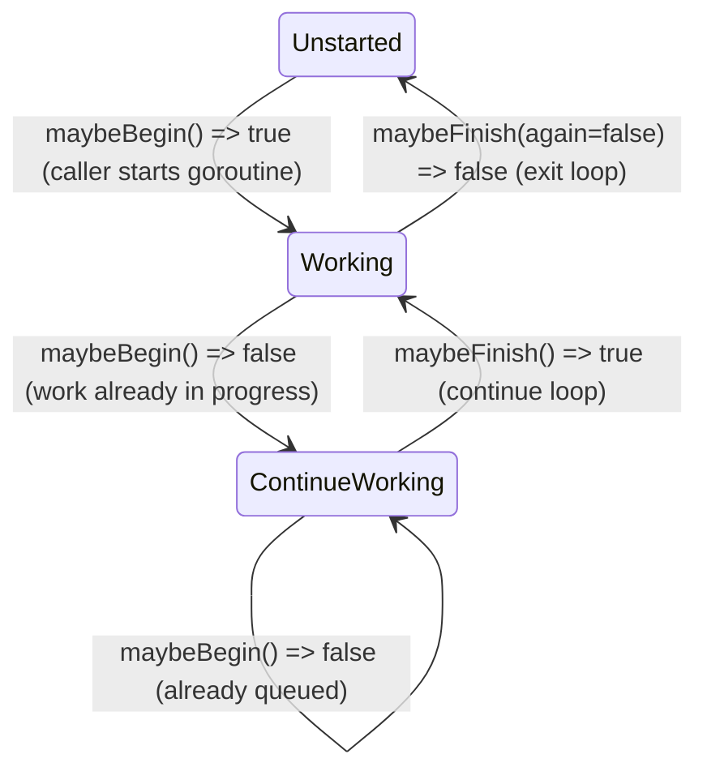
```mermaid
stateDiagram-v2
    state "Unstarted" as U
    state "Working" as W
    state "ContinueWorking" as CW

    U --> W: maybeBegin() => true (caller starts goroutine)
    W --> CW: maybeBegin() => false (work already in progress)
    CW --> CW: maybeBegin() => false (already queued)
    CW --> W: maybeFinish() => true (continue loop)
    W --> U: maybeFinish(again=false) => false (exit loop)
```

`maybeBegin` moves Unstarted to Working and returns true, and the caller
starts the goroutine; if already Working it moves to ContinueWorking. At the
end of each iteration `maybeFinish` demotes ContinueWorking to Working and
returns true, or moves Working to Unstarted and returns false. At most one
goroutine runs, no trigger is lost, and the goroutine exits when idle. Used by
`sink.drainState`, `source.fetchState`, and
`consumer.outstandingMetadataUpdates`.

### ring (`ring.go`)

A queue where pushers add items and one worker processes them in order,
without a permanent goroutine: the push of the first element starts the
worker, and the worker exits when the ring empties.

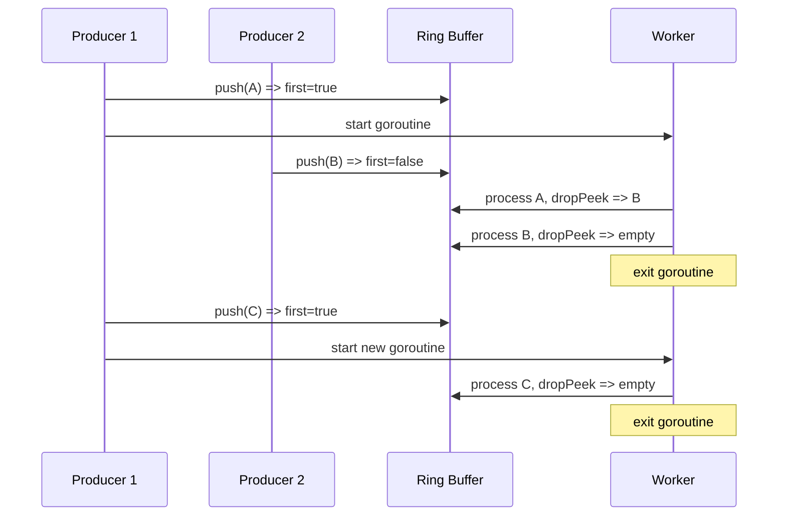
```mermaid
sequenceDiagram
    participant P1 as Producer 1
    participant P2 as Producer 2
    participant Ring as Ring Buffer
    participant W as Worker

    P1->>Ring: push(A) => first=true
    P1->>W: start goroutine
    P2->>Ring: push(B) => first=false
    W->>Ring: process A, dropPeek => B
    W->>Ring: process B, dropPeek => empty
    Note over W: exit goroutine

    P1->>Ring: push(C) => first=true
    P1->>W: start new goroutine
    W->>Ring: process C, dropPeek => empty
    Note over W: exit goroutine
```

The ring starts at capacity 8, doubles when full, and shrinks when mostly
empty. `die` refuses further pushes at shutdown. A ring may have a max length
(`initMaxLen`), at which `push` blocks until the worker drains:
`producer.batchPromises` uses this to backpressure a spin of failing produces
rather than grow without bound, since a record's promise is its only
completion and every accepted record costs memory until it runs. Internal
pushes (sink responses, purge and fail paths, `storePartitionsUpdate`) use
`pushForce`, which ignores the max: they are already bounded by the buffered
records admission, and several run under client locks that your promises can
re-enter, where a parked lock holder would deadlock against the worker, the
ring's only drainer. The worker must never push at the bound either, which is
why producing from inside a promise is documented as spawn a goroutine.

Used by `sink.seqResps`, `producer.batchPromises`, and `brokerCxn.resps`.

### Cursor useState (`source.go`)

```go
func (c *cursor) allowUsable() {
    s := c.source         // read BEFORE Swap
    c.useState.Swap(true) // cursor is now live - do not touch fields after this
    s.maybeConsume()      // wake the correct source
}
```

Remove, modify, swap, add. Never modify after the swap, never add before it.
See [Cursors](#cursors).

## Client metrics (KIP-714)

The broker tells the client which metrics it wants and how often, and the
client pushes them; this is the reverse of the `plugin/kprom` hook, which
exposes metrics to you. `metrics_714.go` runs one `pushMetrics` goroutine,
skipped when client metrics are disabled or the broker does not advertise the
telemetry RPCs. GetTelemetrySubscriptions assigns a `ClientInstanceID` for the
client's lifetime and returns the metric prefixes, push interval, accepted
compression codecs, and max payload; an empty subscription means sleep the
interval and ask again. Each interval, PushTelemetry sends the subscribed
metrics in OpenTelemetry encoding, compressed with an accepted codec. Errors
back off 30s. The metrics accumulate on the request hot paths and roll up at
push time.

## File map

| File | What it does | Key types/functions |
|------|-------------|-------------------|
| `client.go` | Client initialization, sharded request fan-out, cached metadata, coordinator discovery | `Client`, `shardedRequest`, `RequestCachedMetadata` |
| `config.go` | All configuration options | `Opt`, `cfg` |
| `broker.go` | TCP connection management, request/response I/O, SASL | `broker`, `brokerCxn`, `writeConn`, `readConn` |
| `sink.go` | Produce buffering, batching, drain loop, request building, response handling | `sink`, `recBuf`, `recBatch`, `produceRequest` |
| `source.go` | Fetch / ShareFetch request building, response parsing, cursors, decompression | `source`, `cursor`, `sourceShare`, `fetchRequest`, `fetchSession`, `loopShareFetch` |
| `producer.go` | `Produce`, flush, backpressure, unknown topics, promise delivery | `producer`, `Produce`, `Flush` |
| `consumer.go` | Consumer sessions, `PollFetches`, assignment, offsets | `consumer`, `consumerSession`, `Offset` |
| `consumer_group.go` | Classic group join/sync/heartbeat, rebalance, cooperative/eager, commits | `groupConsumer`, `manage`, `heartbeat` |
| `consumer_group_848.go` | KIP-848 group protocol | `manage848`, `should848`, `g848` |
| `consumer_share.go` | KIP-932 share groups | `shareConsumer`, `shareCursor`, `AckStatus`, `shareAckSlab`, `MarkAcks`, `FlushAcks` |
| `consumer_direct.go` | Direct partition assignment, regex topic discovery | `directConsumer`, `findNewAssignments` |
| `metadata.go` | Metadata loop, partition merging, creation and migration | `updateMetadataLoop`, `mergeTopicPartitions` |
| `recreation.go` | Topic recreation gate and per-kind merges | `recreationGate`, `mergeRecreatedCursor` |
| `txn.go` | `GroupTransactSession`, EndTransaction | `GroupTransactSession`, `End` |
| `record_and_fetch.go` | Public `Record`, `Fetch`, `Fetches` | `Record`, `Fetches`, `FetchesRecordIter` |
| `topics_and_partitions.go` | Internal topic/partition tracking, migration | `topicPartition`, `migrateProductionTo` |
| `compression.go` | Compression with sync.Pool reuse | `compressor`, `decompressor` |
| `partitioner.go` | Partitioners | `Partitioner`, `StickyKeyPartitioner` |
| `group_balancer.go` | Classic leader side assignors, rack awareness (KIP-881) | `GroupBalancer`, `stickyBalancer`, `rangeBalancer`, `PartitionRacks` |
| `hooks.go` | Hook interfaces | `Hook`, `HookProduceBatchWritten` |
| `errors.go` | Error types | `ErrDataLoss`, `ErrRecordTimeout` |
| `atomic_maybe_work.go` | `workLoop`, `lazyI32` | `workLoop` |
| `ring.go` | MPSC ring buffer | `ring[T]` |
| `pools.go` | Allocation pools for zero-alloc consuming | `Pool`, `PoolRecords` |
| `record_formatter.go` | Printf-style record formatting | `RecordFormatter` |
| `metrics_714.go` | KIP-714 client telemetry | `pushMetrics` |

## Invariants that have bitten us

Produce side:

- Sequence numbers are per partition, not per request. A batch retried on a
  different sink after a leader move keeps its sequence; `recBuf.seq` tracks
  the next and `batch0Seq` the sequence at the head of the buffer, so a retry
  can reset to it.
- `recBuf.batches[0]` is special. Response handling operates on the first
  batch, because batches complete in order; a response naming a later batch
  is skipped.
- `failAllRecords` locks each batch individually. A concurrent
  `produceRequest.AppendTo` may be serializing that batch; the recBuf mutex
  is not enough.
- Load the producer id BEFORE creating the request. A prior response can
  trigger `errReloadProducerID`, `producerID()` then sets `needSeqReset`, and
  request creation reads it. The other order sends old sequences under a new
  id: OUT_OF_ORDER_SEQUENCE_NUMBER.

Consume side:

- After `useState.Swap(true)` the cursor is live; any field access races a
  fetch (#1167).
- A live session move (`cursorOffsetPreferred.move`) is remove, modify,
  `Swap(true)`, add: writes before the swap, the add after it. A metadata
  driven migration stops the session first, so it is a plain remove, modify,
  add. In both, no source holds the cursor between remove and add.
- Fetch sessions are per source. Resetting one does not touch the others.
- `handleReqResp` runs inside a live session and reads cursor fields that
  metadata updates write. That is safe only because metadata stops the
  session before writing.

Share consumer:

- Per record state lives in `shareAckSlab`, reached from the record's context
  (`shareAckFromCtx`) by pointer arithmetic from `records0`. A `Record`
  materialized outside a fetch decode has no slab and `r.Ack` does nothing.
- The `(source, sessionEpoch)` on every ack is a staleness filter. If you
  change how sessions reset or cursors migrate, check the filter still drops
  what the broker would reject with INVALID_RECORD_STATE.
- `AckRenew` does not persist across polls; `finalizePreviousPoll` accepts it.
- `shareCursor.assigned` is not toggled around request build.
- `leave` must run from a fresh goroutine (`LeaveGroupContext` does). Calling
  it while holding consumer locks deadlocks against the loops it drains.

Group consumer:

- `onAssigned` and `onRevoked` never run concurrently; `assignRevokeSession`
  guarantees it. Any new path to user callbacks goes through it.
- The 848 to classic fallback is one way and transfers ownership of closing
  `manageDone` through `fallbackToClassic`. A new exit from `manage848` must
  still close `manageDone` exactly once.
- Heartbeating starts before offsets are fetched, on purpose, so fetch offset
  errors can arrive mid heartbeat and the loop must handle them.
- In kfake, `group.manage()` must never call `c.admin()`: it deadlocks against
  `Cluster.run()`.

Metadata:

- Both loops of `mergeTopicPartitions` must check `loadErr` and populate
  `retryWhy`. Missing it in the new partitions loop was 40c144d3.
- Migration runs under `recBuf.mu`; records buffered between remove and add
  are safe, since the old sink no longer lists the recBuf.

Connections:

- Cancelling one pipelined request sets the connection deadline to now, which
  kills every in-flight request on it; they get the retryable
  `errChosenBrokerDead`. Expect retry storms if you cancel casually.
- `errChosenBrokerDead` does not mean the broker died. The broker may have
  processed the request, which is why a produce under it sets
  `unsureIfProduced`.
